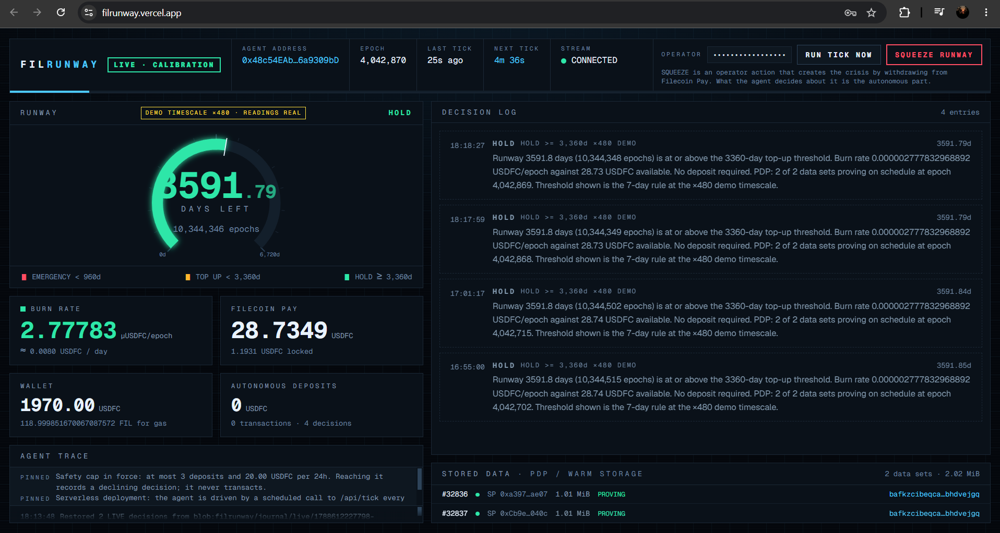
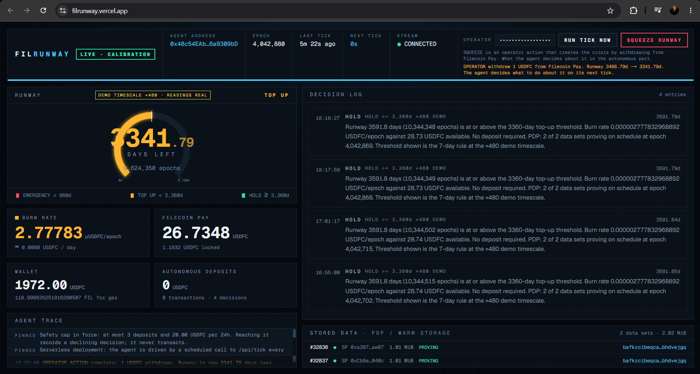
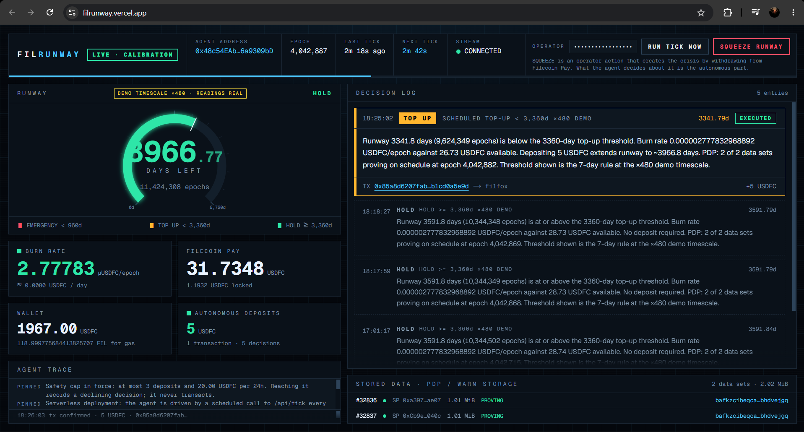
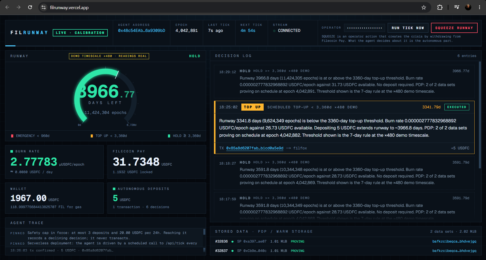

<p align="center"></p>

# FilRunway

**Reads its own runway. Spends its own money. Writes down why.**

An autonomous agent that reads its own onchain balance on Filecoin Pay, decides whether it can still afford the data it is storing, and either tops itself up, cuts what has stopped earning its cost, or records why it is doing neither.

**Live: https://filrunway.vercel.app** — and you can drive it yourself; the operator secret is [published below](#judges-walkthrough-two-minutes).
Built for the **FilecoinTLDR Builder Challenge Cycle 4** — *"Build an AI Agent That Manages Its Own Storage Budget."* Direction: **Stay Alive + Show the Meter**. Network: **Filecoin Calibration**, chain `314159`. Never mainnet.

*The evidence is the record written before the transaction, not the hash that came after.*

---

## What it actually does

Warm Storage is a continuous cost stream — a lockup rate per epoch drawn against a Filecoin Pay balance — and when that balance empties the account goes into debt and the data stops being paid for. Agents can store. Deciding whether the storage is still worth buying is the part nobody does.

One cycle, no human in the path:

1. **Sense** — `payments.accountSummary()` → `runwayInEpochs`, `availableFunds`, `lockupRatePerEpoch`, `debt`, plus both wallet balances.
2. **Read the proofs** — five PDP / Warm Storage fields per data set as one `multicall({ allowFailure: true })`: is it actually being proven?
3. **Decide** — a pure `(RunwaySnapshot, PolicyRule[]) → Decision` maps runway-in-days and proof state onto one of six actions.
4. **Check itself** — a rolling 24h spend cap, then a second, independent check that anything irreversible is armed.
5. **Record** — every decision, **including the decisions to do nothing**, appended to a durable log with the reading behind it.
6. **Act,** if the decision says so — a real `payments.fund()` deposit, or `terminateService()` on a data set that stopped proving.

**Step 5 is the product;** step 6 is only its consequence, which is why [Proof it works](#proof-it-works) is about records rather than hashes.

---

## The core decision

A rule may only ask for `TOP_UP`, `EMERGENCY_TOP_UP` or `HOLD` — `PolicyAction` has no fourth option (`src/lib/types.ts:117`). The agent reaches three further conclusions of its own, and **each is a decision recorded with full reasoning, not a failure** (`DecisionAction`, `src/lib/types.ts:135`).

| Action | Fires when | Spends |
|---|---|---|
| `HOLD` | Runway at or above the threshold. Recorded with its reasoning anyway — an agent that only logs when it acts is not showing you its judgement. | No |
| `TOP_UP` | Runway below **7 days**. Deposits **5 USDFC**. | **Yes** |
| `EMERGENCY_TOP_UP` | Runway below **2 days**. Deposits **15 USDFC**. | **Yes** |
| `INSUFFICIENT_FUNDS` | A rule fired; the wallet cannot cover it. States the shortfall and the fix rather than submitting a transaction guaranteed to revert (`policy.ts:337`). | No |
| `SAFETY_CAP` | The wallet *could* cover it, but the agent has already made 3 deposits or spent 20 USDFC in its own rolling 24h window. It declined itself (`agent.ts:98`). | No |
| `PRUNE_DATASET` | A rule fired **and** a data set was read live, past its PDP proving deadline, and unproven. Ending its payment rail beats buying it more runway (`policy.ts:245`). | If armed |

The load-bearing line is `src/lib/policy.ts:223` — `const rule = selectRule(days, rules);`. `days` came from `accountSummary().runwayInEpochs`, a **first-class onchain field**: FilRunway does not divide a balance by a burn rate and call the result runway, it asks the contract.

**Two refusals worth checking.** *An unread field is never evidence of a missed proof:* a revert or timeout arrives as an absence, not a zero, so `isDelinquent` is false whenever `readable` is false (`src/lib/proof.ts:93`). An RPC wobble must not make the agent cut healthy, paid-for storage. *And the agent declines to spend* — both when it cannot afford the deposit and when it hits its own 24h cap — with the rule that fired still shown in front of its own refusal. `terminateService` is irreversible, so it ships **disarmed**: without `FILRUNWAY_ENABLE_EVICTION=on` the `PRUNE_DATASET` decision is still made, recorded and displayed in full, and nothing is submitted. That record is the autonomy artifact. Every variant: [**deep dive §5–6**](docs/DEEP_DIVE.md#5-the-policy-engine).

---

## Judge's walkthrough (two minutes)

The two `OPERATOR` controls on the live dashboard are authenticated, and the credential is published here **deliberately, for judging**. Paste it into the `OPERATOR` field; it lives in your browser tab's state only — never stored, never in the client bundle, never sent anywhere but the two endpoints it authorises.

```text
1ba794be4b7b47bc91d3a8704f260c957fd5f525a79973473d08d9073a5d0cc4
```

1. **Paste the secret** into the `OPERATOR` field. Both buttons arm.
2. **Press `SQUEEZE RUNWAY` twice.** Each press withdraws 1 USDFC — ~125 days at the ×480 demo scale — so two presses drop a healthy ~3,966 days through the 3,360-day threshold. The collapse is genuine because the withdrawal is, and a pinned banner says a human caused it.
3. **Press `RUN TICK NOW`.** The agent senses, evaluates, returns `TOP_UP` — a real 5 USDFC deposit. *Read the reasoning before the money moves:* it states the post-deposit runway in advance.
4. **Watch the gauge** climb back over the threshold, and land on the number step 3 predicted.
5. **Press `RUN TICK NOW` again.** `HOLD`.

**What that proves.** You manufactured the crisis; the agent chose the response; then it *stopped* — not because you told it to, but because its own deposit had fixed the problem it was reacting to. On the run below, runway went **3341.79 → 3966.77 days** against a predicted "~3966.8", on the top-up the journal records as `0x85a8d620…` and the chain indexes as [`0x400ce862…`](https://filecoin-testnet.blockscout.com/tx/0x400ce8628408da3d4c5b1e09ec7a2533f7e6da374a2a86f33f72a553430e0df7) — see the note under the table.

**Stated plainly rather than reassuringly:** testnet account, faucet funds. The squeeze is a real `payments.withdraw()` to the agent's **own** wallet — both ends are the same account, so it cannot redirect funds to anyone — bounded at 5 USDFC per call, 6 squeezes / 8 USDFC per 24h, above a 1 USDFC reserve. `RUN TICK NOW` can only deposit *into* that balance, capped at 3 deposits / 20 USDFC per 24h, so the withdrawal budget is deliberately the smaller. If the caps are spent, that is the demo too: a refused squeeze returns `429` naming the bound and when it relaxes, a tick with no budget records an amber `SAFETY_CAP` card, and both rolling windows recover on their own ([**§7–8**](docs/DEEP_DIVE.md#7-the-operator-squeeze)).

### What you will see

| | |
|---|---|
|  | **Steady state.** The agent's financial position, live from Filecoin Pay, with its own thresholds drawn onto the gauge. |
|  | **A human made this happen,** and the banner says so. What the agent decides about it is the autonomous part. |
|  | **It decided to spend, and did.** The reasoning predicted ~3966.8 days *before* the money moved. The gauge landed on 3966.77. |
|  | **The frame that matters most.** The agent stopped — because its own deposit had fixed the problem it was reacting to. |

---

## Proof it works

An autonomous `TOP_UP` and an operator typing `npm run bootstrap -- fund 5` produce **byte-identical** transactions on Filecoin Pay. An explorer hash proves *something* deposited USDFC, and nothing else. What separates them is the `Decision` recorded *before* the transaction existed — and one command produces it:

```bash
npm run decisions -- --remote --id 8c158abd-fb71-4e63-83ab-04d5161d97a8
```

It prints the reading the agent was looking at, the rule that fired with its threshold, the reasoning built from those numbers, the outcome, and the first hash below. **Agent wallet: [`0x48c54EAb…6a9309bD`](https://filecoin-testnet.blockscout.com/address/0x48c54EAb7039f43DcAEd14ba44b999E16a9309bD)** — every transaction is from it, to Filecoin Pay, independently checkable.

| Transaction | Block | What it was | Journal-backed? |
|---|---|---|---|
| `0x85a8d620…`, on chain as [`0x400ce862…`](https://filecoin-testnet.blockscout.com/tx/0x400ce8628408da3d4c5b1e09ec7a2533f7e6da374a2a86f33f72a553430e0df7) | 4,042,885 | **5 USDFC autonomous top-up** — the walkthrough above | **Yes.** Decision `8c158abd-fb71-4e63-83ab-04d5161d97a8`. The row you can reproduce yourself. |
| [`0x06e27a6a…`](https://filecoin-testnet.blockscout.com/tx/0x06e27a6a7fd532722727953b8d266f14d8109aaaa2c9edc8645bf17a1a2fcf6b) | 4,034,196 | **5 USDFC autonomous top-up** | **Yes.** Decision `1b2d98ef-4984-482f-b394-498ea99b29a6`, local journal. |
| [`0x17f5ecd7…`](https://filecoin-testnet.blockscout.com/tx/0x17f5ecd765fdef0078241ec1e5b76d4017c96305f7ee80b347bbd29f50d03ac3) | 4,033,951 | 5 USDFC autonomous top-up, during live verification | **No** — predates the journal. Corroborating history, **not** proof. |
| [`0x45ee3b49…`](https://filecoin-testnet.blockscout.com/tx/0x45ee3b49ef5f247860181588b6a6f338fc09befcb3fe57af02de9b4a6608b005) | 4,033,821 | **20 USDFC operator bootstrap** — a human's transaction, listed so the funding split is not something you must take on trust | n/a |

**Why the first row carries two hashes.** The hash a client computes when it signs a transaction and the hash the chain files the resulting message under are derived from different bytes, and for that one top-up they differ. `0x85a8d620…` is what the agent recorded in its journal at submit time — the string `npm run decisions` prints, and the one the "written before the transaction existed" claim rests on. `0x400ce862…` is what the chain indexes, and so the only one an explorer can find. They are the same message: a Calibration node answers `eth_getTransactionByHash` for **either** with the transaction in block 4,042,885, and `Filecoin.EthGetMessageCidByTransactionHash` maps both to the single message CID `bafy2bzacecc2rvra…`. Nothing is reconciled after the fact — the journal is unedited; the link just follows what the chain calls the transaction, and `npm run decisions` now prints both whenever they disagree.

**The honest split:** each agent-initiated top-up is **5 USDFC**; the **20 USDFC** that created the account's position was the operator's. The operator set the account up so there would be a cost stream to manage at all. The agent then decided, on its own, to add to it.

Records are stamped `MOCK` or `LIVE` per line, and the stamp is taken from the **adapter that produced the decision**, never from the environment — `stampMode()` in [`src/lib/journal.ts`](src/lib/journal.ts) is the AND of both answers, so a mock-adapter decision cannot be recorded as LIVE however the process was configured. The two modes write to separate files, and the "transactions the agent authored" listing hard-filters to LIVE-with-a-hash inside the function that builds it. **`data/` is gitignored** — a journal that ships in git is a journal anyone can forge — so a fresh clone starts empty; the deployed agent writes to Vercel Blob, and [`/api/decisions`](https://filrunway.vercel.app/api/decisions) serves the same records publicly, no credentials. Mechanism, and every hash re-verified against an RPC node: [**deep dive §1–2**](docs/DEEP_DIVE.md#1-proving-the-agent-authored-a-transaction), [**§12.2**](docs/DEEP_DIVE.md#122-the-onchain-evidence).

`npm run decisions` re-checks every hash it is about to present with `eth_getTransactionByHash` and labels it with what came back, so an unconfirmed hash is never printed as proof. **A null answer is not a denial.** Filecoin keeps the Ethereum-hash → message mapping for about three days and the public Calibration endpoint is neither archival nor a single node: asked twelve times in a row for `0x06e27a6a…` — a real, three-day-old transaction — it confirmed twice and returned `null` ten times. The reader therefore asks more than once, reports an unresolved older hash as **unconfirmed** rather than fake, and reserves "NOT ON CHAIN" for a record young enough that the node would still hold the mapping. The explorer links above have full history and do not expire; point `FILECOIN_RPC_URL` at an archival node to confirm older records from the CLI.

---

## How Filecoin is used

These are the agent's **decision inputs**, not a backend it happens to sit on. Every address is read from `synapse.chain.contracts` at runtime — **never hardcoded** — so switching networks cannot silently point at the wrong pay contract.

| Primitive | Calibration address | What the agent does with it |
|---|---|---|
| **Filecoin Pay** | [`0x09a0fDc2…41df55a0`](https://filecoin-testnet.blockscout.com/address/0x09a0fDc2723fAd1A7b8e3e00eE5DF73841df55a0) | `accountSummary()` → `runwayInEpochs`, `availableFunds`, `debt`, `lockupRatePerEpoch`. **The input the decision turns on.** `fund()` tops up; `withdraw()` is the squeeze. |
| **PDP Verifier** | [`0x85e366Cf…18d6417C`](https://filecoin-testnet.blockscout.com/address/0x85e366Cf9DD2c0aE37E963d9556F5f4718d6417C) | `dataSetLive`, `getDataSetLastProvenEpoch`, `getNextChallengeEpoch` — alive, and last proven when? |
| **Warm Storage** | [`0x02925630…65417CA0`](https://filecoin-testnet.blockscout.com/address/0x02925630df557F957f70E112bA06e50965417CA0) | `upload()` created the cost stream. `terminateService()` is `PRUNE_DATASET`, gated off by default. |
| **Warm Storage View** | [`0x9BF9e67e…EE937177`](https://filecoin-testnet.blockscout.com/address/0x9BF9e67e83EC8613883FDdDec4D3b38AEE937177) | `provenThisPeriod`, `provingDeadline` — what separates *delinquent* from merely quiet. |
| **USDFC** | [`0xb3042734…89B4cDf0`](https://filecoin-testnet.blockscout.com/address/0xb3042734b608a1B16e9e86B374A3f3e389B4cDf0) | The token runway is denominated in; the balance that makes `INSUFFICIENT_FUNDS` real. |
| **Multicall3** | `0xcA11bde0…3976CA11` | All proof reads as one `allowFailure` batch, so a partial read is a stated UNKNOWN, not a false delinquency. |

Two live data sets (~1 MiB each, two providers) — see [`/api/storage`](https://filrunway.vercel.app/api/storage). Addresses in full: [**§12.4**](docs/DEEP_DIVE.md#124-the-filecoin-primitives-by-address).

---

## Architecture

```
 Filecoin Calibration · Pay · Warm Storage · PDP · USDFC
            ^  @filoz/synapse-sdk (viem)
 +----------+----------------------------------------+
 | src/lib/chain/   THE ONLY PLACE WITH A PRIVATE KEY |
 | SynapseChainAdapter | MockChainAdapter | interface |
 +----------+----------------------------------------+
            |  RunwaySnapshot (plain JSON)
 +----------v----------------------------------------+
 | agent.ts  runTick(): sense -> decide -> act        |
 |   proof.ts   PDP proof state ...............PURE   |
 |   policy.ts  evaluate() -> Decision ........PURE   |
 |   spendGuard / squeezeGuard  24h caps ......PURE   |
 |   eviction.ts  may a PRUNE submit? .........PURE   |
 |   store.ts  ring + SSE -> journal.ts / blobJournal |
 +----------+----------------------------------------+
            |  SSE
 /api/snapshot decisions stream storage
 /api/tick /api/squeeze <- CRON_SECRET, constant time;
                           the only routes moving funds
            |
 Dashboard: RunwayGauge · DecisionFeed · StatTile ·
            StoragePanel · OperatorControls
```

**The key design decision: nothing above `src/lib/chain/` imports the Synapse SDK or can see a private key.** Everything is written against `RunwaySnapshot` and `Decision` in `src/lib/types.ts`, which is why the same dashboard and policy engine run unchanged against a simulated chain and a live one — and why the parts a judge is most likely to doubt are the parts easiest to test. `evaluate()` is snapshot and rules in, decision out: no clock read unless injected, no chain call, no side effect. **532 tests across 27 files**, no network or key required; 43 pin the policy engine alone. The journal write is **durable first**, before the ring and before SSE, so a decision cannot reach a screen it never reached the record. Step by step: [**deep dive §3–4**](docs/DEEP_DIVE.md#3-architecture-in-depth).

---

## Endpoints

| Route | |
|---|---|
| `GET /api/snapshot` | The current reading, plus agent status. |
| `GET /api/decisions?limit=N` | The journal, publicly, with tx hashes and decision ids. |
| `GET /api/storage` | Data sets, providers, sizes, piece CIDs, proof state. **503** on a chain-read failure — allowed to fail alone rather than take the dashboard down. |
| `GET /api/stream` | SSE: `snapshot`, `decision`, `tx`, `log`, `totals`, `notices`. |
| `POST`/`GET /api/tick` | Runs one cycle. **Can spend**, so both verbs require `Authorization: Bearer $CRON_SECRET` under the cron driver — **401** without it, **503** if the deployment holds no secret. Fail-closed. |
| `POST /api/squeeze` | The operator's withdrawal. **POST only** — a GET that withdraws funds is a link that drains a wallet when something prefetches it. Creates no `Decision`. |

---

## Running it

**Mock mode needs no key, no RPC and no funds.** Node 20.6+:

```bash
npm install && npm run dev     # localhost:3000, FILRUNWAY_MODE=mock by default
```

Chain time runs 120× there, so the runway drains visibly and the agent crosses HOLD → TOP_UP → EMERGENCY_TOP_UP in about four minutes. It is labelled `MOCK DATA` in three independent places and journals to its own file, so it can never be totalled as real.

For **live mode**, use a fresh Calibration key you do not care about — a hot key in a dotfile — funded from both faucets ([tFIL](https://faucet.calibnet.chainsafe-fil.io), [USDFC](https://faucet.reiers.io)):

```bash
cp .env.example .env               # set FILRUNWAY_MODE=live and FILECOIN_PRIVATE_KEY
npm run bootstrap -- status        # read-only smoke test: key, RPC, balances, approval
npm run bootstrap -- approve       # only if approval is missing
npm run bootstrap -- fund 5        # deposit USDFC into Filecoin Pay
npm run bootstrap -- upload --demo # 1 MiB through PDP / Warm Storage — the cost stream
npm run dev
```

With nothing stored there is no budget to manage: `lockupRatePerEpoch` is `0` and the gauge correctly reads infinity. Then `npm run test` · `typecheck` · `lint` · `build`. Environment reference and the Vercel runbook: [**deep dive §10–11**](docs/DEEP_DIVE.md#10-setup-reference).

---

## Limitations, stated plainly

- **The demo timescale scales thresholds, never readings.** Storage here costs ~0.24 USDFC/month, so the account reads in the thousands of days and nothing fires on its own. `FILRUNWAY_DEMO_SCALE` multiplies the **policy thresholds** and gauge **graduations** and touches no chain reading. It does not speed the burn either, so scaling alone cannot show a runway *falling through* a threshold — that is what the squeeze is for. The scale in force is stated on the gauge badge, every rule label and every decision's reasoning ([**§9**](docs/DEEP_DIVE.md#9-the-demo-timescale)).
- **The scheduler is best-effort, and unproven here.** [`agent-tick.yml`](.github/workflows/agent-tick.yml) posts to `/api/tick` on a 5-minute cron, but GitHub's scheduled workflows can be delayed or skipped — and **this project has not yet observed its scheduled runs firing.** Five minutes is the intended floor, not a demonstrated cadence.
- **The destructive response ships disarmed.** `PRUNE_DATASET` decides, records and displays, but submits only with `FILRUNWAY_ENABLE_EVICTION=on`. Value-ranking is not implemented: delinquency is the only criterion, and the lowest id wins rather than the least valuable.
- **No partial top-up, and no backoff.** A short wallet gives `INSUFFICIENT_FUNDS` rather than a smaller deposit; a failed deposit retries next tick at the same amount. The cap bounds the money, not the attempts — and a *failed* deposit consumes no cap.
- **Post-prune re-sizing is a bound, not a measurement,** because Filecoin Pay reports one aggregate lockup rate with no per-rail split. The agent divides pro-rata by rail count, says so in those words, and re-decides next reading.
- **The spend cap is eventually consistent across Function instances,** not transactionally exact — each re-reads the shared journal on a 3-second TTL. It is an append-only evidence log, not a database: the ring holds 200 decisions, anything ageing out folds into server-side `totals`, and a journal that cannot be written disables itself with a pinned warning while the agent carries on in memory.
- **Hot key in a file** (confined to two modules, scrubbed from every error that escapes them), and **not verified against a long-running live deployment** — no coverage of sustained multi-hour behaviour, real cron delivery, cross-instance journal convergence under concurrency, or an armed `terminateService`. Testnet only.

Long-form versions, with the code behind each claim: [**deep dive §13**](docs/DEEP_DIVE.md#13-known-limitations-in-full).

---

## More

[**`docs/DEEP_DIVE.md`**](docs/DEEP_DIVE.md) — the reference companion: evidence mechanism, architecture, the tick step by step, the policy engine, proof state and eviction, the squeeze, the spending cap, the demo timescale, the environment reference and the Vercel runbook. · [`docs/DEMO_SCRIPT.md`](docs/DEMO_SCRIPT.md) — shot-by-shot video script. · [`docs/SHOWCASE.md`](docs/SHOWCASE.md) — submission blurb and X thread. · [`.env.example`](.env.example) — every variable, with the reasoning above it, no values.

Next.js 16 (App Router, React 19), TypeScript strict, Tailwind v4, `@filoz/synapse-sdk` — **viem-based, not ethers** — Vitest, and Vercel Blob for the deployed journal. Transport is Server-Sent Events; there is no database. The logo (`docs/img/logo.svg`) draws its gauge bands at the real policy thresholds, so the mark is a picture of the policy.
